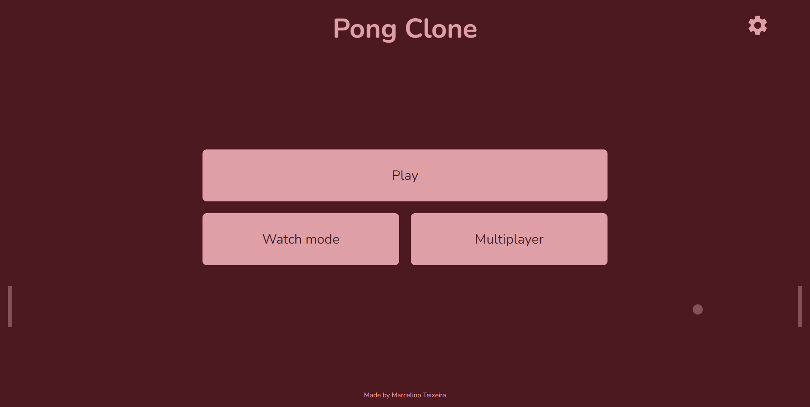

<h1 align="center">
  Pong Clone
</h1>

  <a href="#-tecnologias">Tecnologias</a>&nbsp;&nbsp;&nbsp;|&nbsp;&nbsp;&nbsp;
  <a href="#-projeto">Projeto</a>&nbsp;&nbsp;&nbsp;|&nbsp;&nbsp;&nbsp;
  <a href="#-como-executar">Como executar</a>

  

## 🧪 Tecnologias

Esse projeto foi desenvolvido com as seguintes tecnologias:

- [React](https://reactjs.org/)
- [TypeScript](https://www.typescriptlang.org/)

## 💻 Projeto

<h4>Acesse em: https://pong-clone.vercel.app</h4>

Baseado no [video](https://www.youtube.com/watch?v=PeY6lXPrPaA) do canal [Web Dev Simplified](https://www.youtube.com/c/WebDevSimplified/videos), que fez o jogo Pong utilizando Vanilla JavaScript, esta versão foi adaptada para React com Typescript.

## 💣 Funcionalidades

- Menu de modos de jogo animado
- Modal de configurações onde é possível personalizar o jogo
- Modo de jogo `Watch Mode`
- Modo de jogo `Multiplayer` utilizando o teclado
- Timing antes de começar a partida

## 🚀 Como executar

- Clone o repositório
- Instale as dependências com `yarn`
- Inicie o servidor com `yarn dev`

Agora seu servidor está rodando no [`localhost:3000`](http://localhost:3000).
